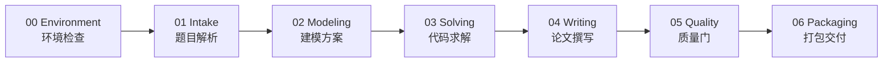

# EZ Math Model Star Map / 技能星图

[中文 README](README.md) | [English README](README.en.md)

This map shows how the skill is organized for marketplace readers and future agents. Stars mark how central a module is to the modeling workflow.

本星图用于展示 EZ Math Model 的能力分布和调用路径。星级表示该模块在主流程中的核心程度。

All entries below are relative to `skills/ez-math-model/`.

下列入口路径均相对 `skills/ez-math-model/`。

## Legend / 图例

| Stars | Meaning |
|---|---|
| ★★★★★ | Core path, used in nearly every modeling task |
| ★★★★☆ | Frequent support path |
| ★★★☆☆ | Conditional tool path |
| ★★☆☆☆ | Optional polish or extension |

## Main Constellation / 主流程星座

| Node | Stars | Entry | Role |
|---|---:|---|---|
| Environment | ★★★★★ | `pipeline/00-environment-setup.md` | Python, fonts, tool decisions, workdir |
| Intake | ★★★★★ | `pipeline/01-problem-intake.md` | problem text, attachment preview, contest signals |
| Modeling | ★★★★★ | `pipeline/02-modeling-plan.md` | model selection and solution plan |
| Solving | ★★★★★ | `pipeline/03-coding-solve.md` | Python scripts, tables, figures |
| Writing | ★★★★★ | `pipeline/04-paper-writing.md` | contest paper draft |
| Quality | ★★★★☆ | `pipeline/05-quality-audit.md` | evidence-backed checks |
| Packaging | ★★★★☆ | `pipeline/06-packaging-output.md` | final deliverable bundle |

## Role Constellation / 角色星座

| Role | Stars | Prompt | Guide |
|---|---:|---|---|
| Coordinator | ★★★★☆ | `prompts/coordinator.md` | `prompts/shared.md` |
| Modeler | ★★★★★ | `prompts/modeler.md` | `references/roles/modeler-guide.md` |
| Coder | ★★★★★ | `prompts/coder.md` | `references/roles/coder-guide.md` |
| Writer | ★★★★★ | `prompts/writer.md` | `references/roles/writer-guide.md` |

## Algorithm Constellation / 算法星座

| Area | Stars | Reference |
|---|---:|---|
| Optimization | ★★★★★ | `references/algorithms/01-optimization.md` |
| Prediction | ★★★★★ | `references/algorithms/02-prediction.md` |
| Evaluation | ★★★★★ | `references/algorithms/03-evaluation.md` |
| Graph and network | ★★★★☆ | `references/algorithms/04-graph.md` |
| Statistics and data processing | ★★★★☆ | `references/algorithms/05-statistics.md` |
| Comprehensive modeling | ★★★★☆ | `references/algorithms/06-comprehensive.md` |
| Machine learning | ★★★☆☆ | `references/algorithms/07-machine-learning.md` |

## Tool Constellation / 工具星座

| Tool | Stars | Entry | When It Lights Up |
|---|---:|---|---|
| docx | ★★★★☆ | `tools/docx/SKILL.md` | Markdown to Word, DOCX problem reading |
| pdf | ★★★★☆ | `tools/pdf/SKILL.md` | PDF fallback extraction |
| mineru | ★★★★☆ | `tools/mineru/SKILL.md` | Chinese academic PDF, tables, formulas |
| xlsx | ★★★★★ | `tools/xlsx/SKILL.md` | CSV/XLS/XLSX data attachments |
| paper-search | ★★★★☆ | `tools/paper_search/SKILL.md` | OpenAlex and multi-source literature metadata |
| scholar | ★★★☆☆ | `tools/scholar/SKILL.md` | short alias for paper-search workflows |
| dataset | ★★★☆☆ | `tools/dataset/SKILL.md` | public dataset discovery |
| webcrawl | ★★★☆☆ | `tools/webcrawl/SKILL.md` | policy, industry, geography, economy context |
| user-corpus-explorer | ★★★★☆ | `tools/user-corpus-explorer/SKILL.md` | local user reference indexing |

## Support Constellation / 辅助星座

| Support Skill | Stars | Entry | Purpose |
|---|---:|---|---|
| brainstorming | ★★★☆☆ | `tools/brainstorming/SKILL.md` | model choice escape hatch |
| systematic-debugging | ★★★★☆ | `tools/systematic-debugging/SKILL.md` | root-cause diagnosis after repeated failures |
| verification-before-completion | ★★★★☆ | `tools/verification-before-completion/SKILL.md` | evidence before completion claims |
| humanizer | ★★☆☆☆ | `tools/humanizer/SKILL.md` | prose polish after paper draft |
| simplify | ★★☆☆☆ | `tools/simplify/SKILL.md` | code quality review |
| scientific-slides | ★★☆☆☆ | `tools/scientific-slides/SKILL.md` | defense slides after packaging |
| dispatching-parallel-agents | ★★★☆☆ | `tools/dispatching-parallel-agents/SKILL.md` | independent subtask dispatch |
| external-context | ★★★☆☆ | `tools/external-context/SKILL.md` | parallel outside-domain context |
| subagent-driven-development | ★★☆☆☆ | `tools/subagent-driven-development/SKILL.md` | developing EZ Math Model itself |

## Navigation Rule / 导航规则

Start at `skills/ez-math-model/SKILL.md`. Load only the next pipeline file and the specific role/tool document needed by the current stage. The star map is for discovery and marketplace presentation, not a replacement for the pipeline contracts.
